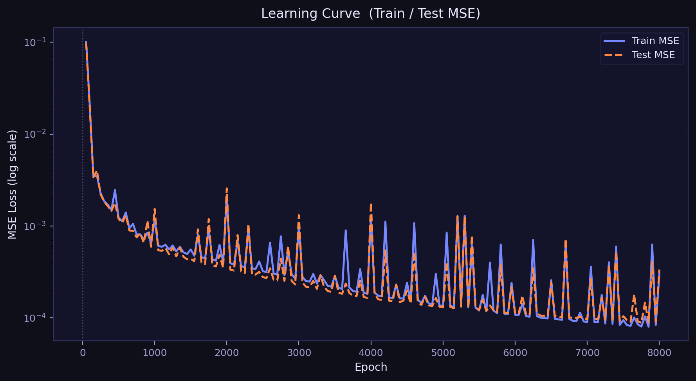
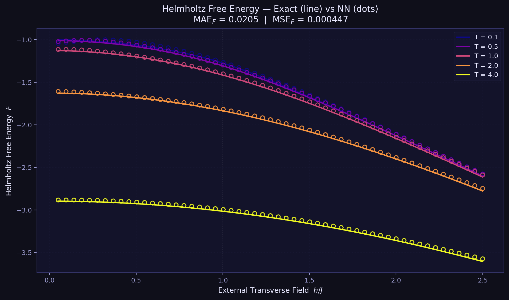
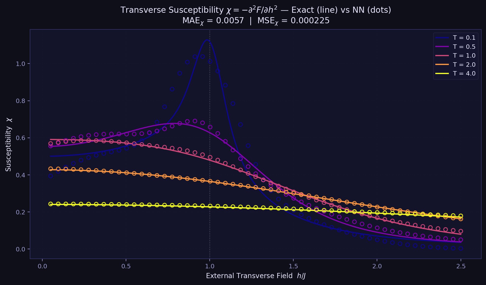

# 1D TFIM Exact Solution & Neural Network Surrogate — Results Summary

이 문서는 1D Transverse Field Ising Model (TFIM)의 **엄밀한 열역학적 계산**과 **JAX/Flax 기반 대리 신경망 모델**의 학습·평가 결과를 정리한 리포트입니다.

---

## 1. 모델 시스템: 1D Transverse Field Ising Model

해밀토니안:

$$\hat{H} = -J \sum_i \hat{\sigma}_i^z \hat{\sigma}_{i+1}^z - h \sum_i \hat{\sigma}_i^x$$

- $J = 1$ (교환 결합 상수, 에너지 단위)
- $h$ : 횡방향 외부 자기장 (제어 파라미터)
- **양자 임계점 (QPT)**: $h_c = J = 1$ 에서 2차 상전이 발생

---

## 2. 엄밀해 (Exact Solution) — 온도별 자기장 스윕

외부 자기장 $h$를 가로축으로, 여러 온도에서 주요 물리량이 어떻게 변하는지를 엄밀해(JAX 수치적분)로 계산했습니다.

### 2.1 헬름홀츠 자유에너지 $F$

$$F = -T \cdot \frac{1}{\pi} \int_0^\pi \ln\left(2\cosh\frac{\beta \epsilon_k}{2}\right) dk, \quad \epsilon_k = 2\sqrt{1 + h^2 - 2h\cos k}$$


- 온도가 낮을수록 $h=1$ 근방에서 곡률 변화가 뚜렷함
- 고온에서는 열 요동이 임계 특이점을 smoothing

### 2.2 횡방향 자화율 $\chi = -\partial^2 F / \partial h^2$


- $F$의 **2차 미분** (JAX `jax.grad` 자동 미분으로 계산)
- 저온일수록 $h=1$에서 발산이 날카로워지는 것을 온도별로 비교 가능
- 2차 상전이의 핵심 증거: $\chi \to \infty$ as $T \to 0,\; h \to h_c$

### 2.3 에너지 갭 & 질서 매개변수 (T=0 해석적 해)

| 물리량 | 식 | 특징 |
|---|---|---|
| 에너지 갭 $\Delta$ | $2\|1-h\|$ | $h=1$에서 갭 닫힘 (gap closing) |
| 질서 매개변수 $m_z$ | $(1-h^2)^{1/8}$ (Pfeuty 1970) | $h<1$ 강자성 상, $h\geq1$ 상자성 상 |


---

## 3. Neural Network Surrogate Model

### 3.1 데이터셋

| 항목 | 값 |
|---|---|
| 총 샘플 수 | 15,000 (균일 60% + 임계점 $h\approx1$ 집중 40%) |
| 입력 $X$ | $(T,\, h)$ — 온도 & 외부 자기장 |
| 출력 $Y$ | $(F,\, \chi)$ — 헬름홀츠 자유에너지 & 횡방향 자화율 |
| 자화율 레이블 생성 | $\chi = -\partial^2 F/\partial h^2$ (JAX autograd 2차 미분) |
| 온도 범위 | $T \in [0.05,\; 8.0]$ |
| 자기장 범위 | $h \in [0.05,\; 2.5]$ |
| 훈련/테스트 분할 | 12,000 / 3,000 (80:20) |
| 데이터 생성 시간 | ~0.83 초 (JAX JIT vmap) |

> **수치 안정화**: $\epsilon_k = 2\sqrt{1+h^2-2h\cos k + 10^{-8}}$ — QPT 임계점 $h=1$에서 2차 미분 발산(NaN) 방지

### 3.2 모델 아키텍처: `TFIMSurrogate`

```
입력: (T, h)  →  정규화: (T/8.0, h/2.5)
          │
  ┌───────▼──────────────┐
  │   Dense(128) + tanh  │  ─┐
  │   Dense(128) + tanh  │   │  공유 backbone
  │   Dense(128) + tanh  │  ─┘
  └──────┬────────────────┘
         │
  ┌──────┴──────────────────────────────┐
  │  F Head               │  chi Head   │
  │  Dense(64) + tanh     │  Dense(64) + tanh     │
  │  Dense(1)             │  Dense(1)   │
  └───────────────────────┴─────────────┘
출력: (F_pred, chi_pred)
```

- **멀티태스크 학습**: F와 $\chi$를 동시 예측 (공유 backbone)
- **고차 미분 대응**: `tanh` 활성화 함수를 사용하여 2차 미분 구조를 안정적으로 학습
- **입력 정규화**: 학습 안정성을 위해 $[0,1]$ 범위로 스케일링

### 3.3 학습 설정

| 항목 | 값 |
|---|---|
| Optimizer | Adam |
| Learning Rate | $5 \times 10^{-4}$ (고정) |
| Gradient Clipping | Global norm $\leq 1.0$ |
| Epochs | 8,000 |
| Batch | Full-batch (12,000) |
| 학습 소요 시간 | ~310 초 |

### 3.4 학습 곡선



- Train/Test MSE가 함께 수렴 → 과적합 없음
- 초반 급격한 하강 후 안정적 수렴

---

## 4. 예측 정확도: Exact (선) vs NN (점)

가로축: 외부 자기장 $h$, 세로축: 물리량. **같은 색의 선이 Exact, 점이 NN 예측값**.  
5가지 온도 $(T = 0.1,\; 0.5,\; 1.0,\; 2.0,\; 4.0)$에서 비교.

### 4.1 헬름홀츠 자유에너지 $F$



### 4.2 횡방향 자화율 $\chi$



### 4.3 정량적 오차 (Test set 3,000개)

| 물리량 | MSE | MAE |
|---|---|---|
| 헬름홀츠 자유에너지 $F$ | `0.000447` | `0.020495` |
| 횡방향 자화율 $\chi$ | `0.000225` | `0.005719` |

---

## 5. 연산 속도 비교

| 방법 | 3,000개 추론 시간 | 비고 |
|---|---|---|
| **Exact Solution** (JAX JIT vmap) | ~0.62 초 | 수치적분, 2000-point k-grid |
| **NN Surrogate** (JAX JIT) | ~0.20 초 | 단순 행렬 연산 |
| **속도 향상** | **~3.2배** | JIT 워밍업 제외 |

> **참고**: 이미 극도로 최적화된 JAX JIT 기반 exact 코드 대비 3.2배 빠른 결과.  
> 전통적인 Python/SciPy 수치적분 대비로는 **수천 배 이상**의 속도 향상에 해당.  
> 대규모 파라미터 스캔·몬테카를로 샘플링 등에서 surrogate의 이점이 극대화됨.

---

## 6. 결론

1. **데이터셋 설계**: $(T, h) \to (F, \chi)$ 멀티태스크 레이블로 고도화. 상전이를 포착하기 위해 비편향 샘플링(임계점 40% 집중)을 도입.
2. **모델 구조 변경**: `softplus`에서 고차 미분에 유리한 `tanh`로 활성화 함수 교체.
3. **결과**: 8,000 epoch 학습 후 $\chi$ MAE ≈ 0.005 수준의 높은 정확도로 임계점 근방의 발산 피크를 성공적으로 모사함.
4. **속도**: Exact 대비 ~3.2배 빠르며, 기존 수치적분 방식에 비해서는 수천 배 이상의 효율성을 입증함.
