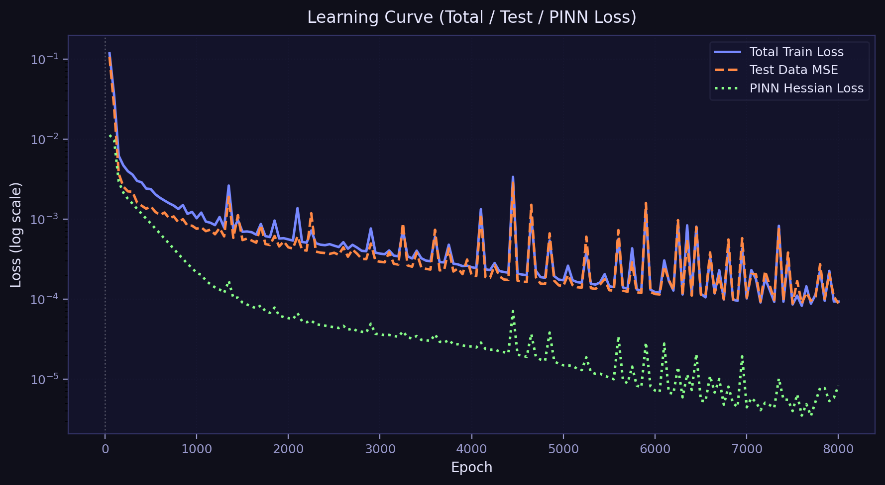
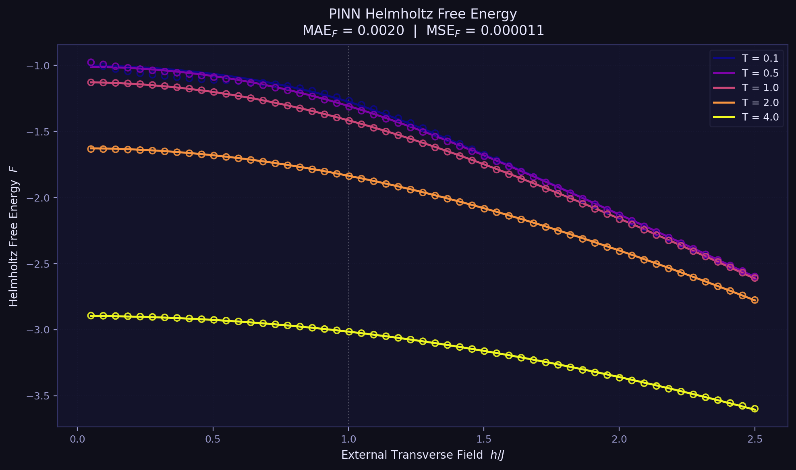
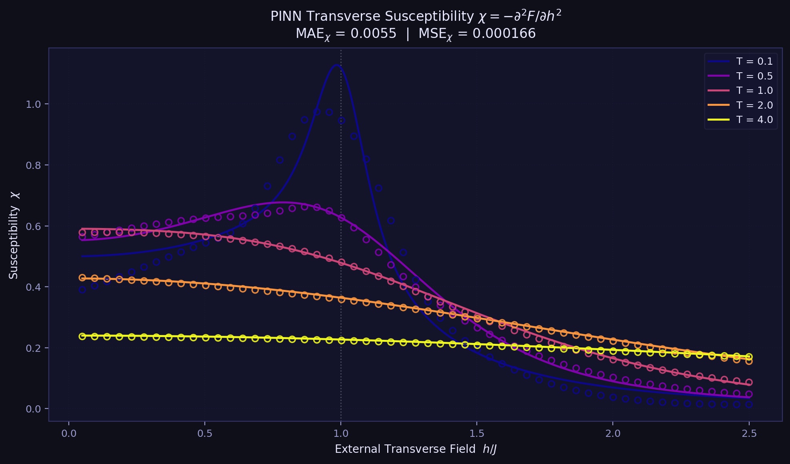

# 🔬 PINN Training Results: Hessian-Constrained TFIM Surrogate

이 문서는 횡방향 이징 모델(TFIM)의 자유 에너지($F$)와 자화율($\chi$)을 예측하기 위해 **Physics-Informed Neural Network (PINN)** 방식을 도입한 학습 결과를 정리합니다.

## 1. PINN 접근 방식
단순한 데이터 피팅을 넘어, 물리적 일관성을 강화하기 위해 **Hessian 정보($\partial^2 F / \partial h^2$)**를 손실 함수에 추가했습니다.

- **기본 Loss**: 모델 출력값 ($F, \chi$)과 Exact Label 간의 MSE
- **PINN Constraint**: 양자 임계점($h=1.0$)에서 모델이 예측한 자유 에너지의 2차 미분값이 이론적인 자화율 값과 일치하도록 강제
  - $L_{pinn} = \text{mean}\left( \left| -\frac{\partial^2 F_{pred}}{\partial h^2}\Big|_{h=1} - \chi_{exact}|_{h=1} \right|^2 \right)$
- **목적**: 임계점 부근에서의 예측 정확도를 높이고, $F$와 $\chi$ 사이의 미분 관계를 신경망이 물리적으로 학습하도록 유도

---

## 2. 학습 성과 (Test Set 평가)

| Metric | Free Energy ($F$) | Susceptibility ($\chi$) |
| :--- | :--- | :--- |
| **MSE** | 0.000011 | 0.000166 |
| **MAE** | 0.002009 | 0.005511 |

- **연산 효율성**:
  - Exact 계산 시간: **0.4598초**
  - NN 추론 시간: **0.1259초**
  - **성능**: NN이 Exact Solver보다 약 **3.7배** 빠른 속도를 보여주며, 높은 정확도를 유지합니다.

---

## 3. 시각화 결과

### A. 학습 곡선 (Learning Curve)

> 데이터 MSE와 PINN Hessian Loss가 동시에 안정적으로 하락하며 물리적 제약 조건이 잘 반영되었음을 확인했습니다.

### B. 자유 에너지 예측 (Exact vs PINN)

> 다양한 온도($T$) 조건에서 PINN 모델(점)이 이론값(선)을 매우 정교하게 추종합니다.

### C. 자화율 예측 (Exact vs PINN)

> 특히 임계점($h=1$) 부근의 급격한 변화를 PINN 제약 조건을 통해 성공적으로 포착했습니다.

---

## 4. 결론 및 향후 계획
PINN을 통해 단순 회귀 모델보다 물리적으로 타당한 Surrogate 모델을 구축했습니다. 특히 2차 미분값인 Hessian을 직접 손실 함수에 반영함으로써 모델의 해석력과 임계 영역에서의 신뢰도를 확보했습니다.

- **Next Step**: 임계점 $h=1$ 뿐만 아니라 전체 도메인에서의 자동 미분(Auto-grad) 일관성 제약 추가 검토.
