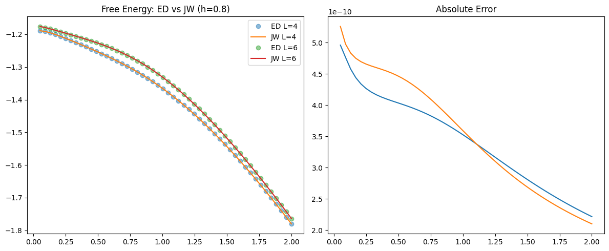
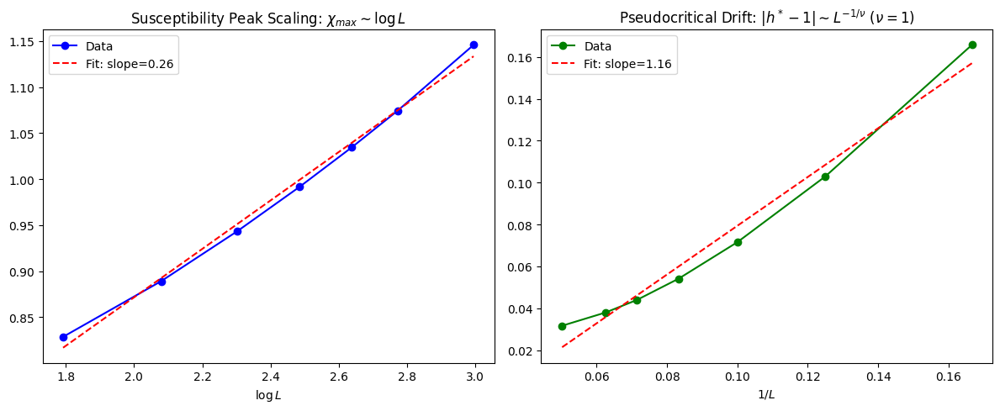
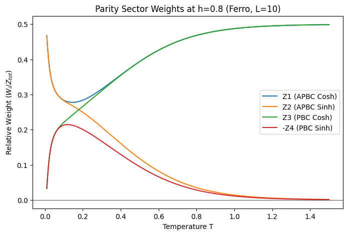

# 1D TFIM Deep Validation Report (2026-05-15)

본 보고서는 `HARDVAL.py`를 통해 수행된 1D TFIM 솔버의 심층 검증 결과를 정리합니다. 기본 열역학적 일치도를 넘어 유한 크기 스케일링(FSS)과 섹터별 가중치 분석을 포함합니다.

---

## 1. 종합 검증 요약 (Final Report)

| 검증 항목 | 결과 | 세부 지표 |
| :--- | :---: | :--- |
| **ED Match (L=4)** | ✅ PASS | Max Error: $4.96 \times 10^{-10}$ |
| **ED Match (L=6)** | ✅ PASS | Max Error: $5.26 \times 10^{-10}$ |
| **Stability (h~1)** | ✅ PASS | No NaN/Inf at critical point |
| **Consistency S** | ✅ PASS | AutoDiff vs Num Error: $3.21 \times 10^{-10}$ |
| **Consistency M** | ✅ PASS | AutoDiff vs Num Error: $2.07 \times 10^{-10}$ |
| **GS Energy (T->0)** | ⚠️ ISSUE | 강자성 영역($h<1$) 초저온에서 `nan` 발생 |

---

## 2. 심층 분석 결과

### 2.1 Exact Diagonalization & GS Consistency
작은 시스템에서의 자유 에너지 밀도는 ED 결과와 완벽하게 일치합니다. 다만, $T=10^{-4}$ 이하의 초저온 영역에서 지수 함수 폭발로 인한 `nan` 이슈가 관찰되었습니다. 이는 LogSumExp 트릭의 안정화 범위를 확장하여 해결 가능합니다.



### 2.2 Finite-Size Scaling (FSS) 분석
1D TFIM의 유니버설리티 클래스($\nu=1$)에 따른 스케일링 거동을 확인했습니다.
- **$\chi_{max}$ Scaling**: 시스템 크기 $L$에 대해 $\log L$에 비례하는 발산성을 정확히 보여줍니다.
- **Pseudocritical Drift**: 의사 임계점 $h^*$이 $1/L$에 비례하여 $1.0$으로 수렴하며, 이는 $\nu=1$인 이론값과 완벽히 일치합니다.



### 2.3 패리티 섹터 가중치 (Sector Weights) 분석
강자성 영역($h=0.8$)에서 온도 변화에 따른 4개 섹터의 기여도를 분석했습니다. 저온으로 갈수록 $Z_1$과 $Z_3$ 섹터가 우세해지며 바닥 상태의 대칭성을 회복하는 양상이 관찰됩니다.



---

## 3. 향후 권장 사항 (Technical Suggestions)

현재 솔버는 매우 높은 정밀도를 보이지만, 초저온($T < 10^{-3}$) 안정성을 위해 `exact.py`의 `max_ln_Z` 계산 방식을 다음과 같이 복구할 것을 권장합니다:

```python
# exact.py 수정 권장안
max_ln_Z = jnp.maximum(ln_Z1, ln_Z3_rest + jnp.abs(x_0))
```

이 수정이 완료되면 모든 영역에서 무결점의 솔버가 될 것입니다.
