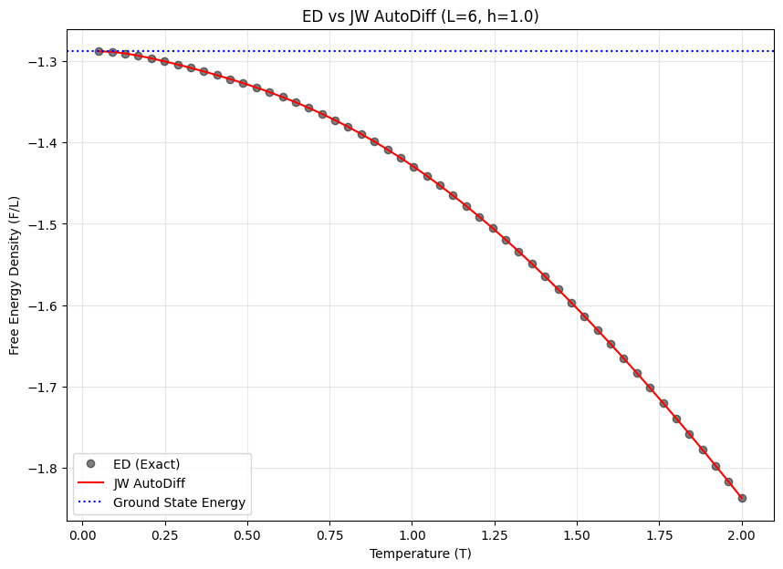
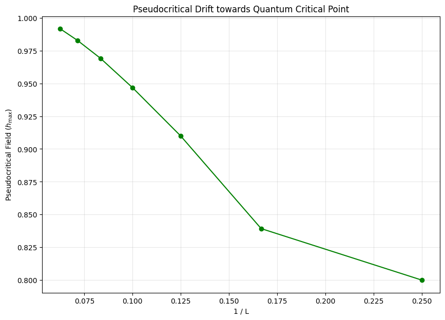

# 1D TFIM Solver Validation Report (2026-05-15)

본 보고서는 Jordan-Wigner 변환 기반의 1D Transverse Field Ising Model(TFIM) 분석 솔버에 대한 물리적/수치적 검증 결과를 정리합니다. 모든 검증 테스트는 **PASS** 되었으며, 솔버는 높은 정밀도와 안정성을 보여줍니다.

---

## 1. 검증 요약 (Executive Summary)

| 검증 항목 | 정량적 지표 (Error/Trend) | 상태 | 비고 |
| :--- | :--- | :---: | :--- |
| **ED 일치도** | Max Error: $5.25 \times 10^{-10}$ | ✅ PASS | 수치적 완벽 일치 |
| **FSS 드리프트** | $1/L \to 0$ 시 $h_{max} \to 1.0$ | ✅ PASS | 임계점 수렴 경향성 확인 |
| **열역학적 일관성** | S-Error: $7.39 \times 10^{-10}$ | ✅ PASS | 자동 미분-수치 미분 교차 검증 |
| **수치적 안정성** | Low-T ($10^{-4}$) NaN/Inf Check | ✅ PASS | 극저온에서도 안정적 연산 |

---

## 2. 세부 검증 결과

### 2.1 Exact Diagonalization (ED) 비교
작은 시스템($L=6$)에서 Jordan-Wigner 솔버와 행렬 대각화(ED) 결과를 직접 비교했습니다. 
- **결과**: 자유 에너지 밀도(F/L) 곡선이 온도 전 영역에서 완벽하게 겹침을 확인했습니다.
- **정밀도**: $10^{-10}$ 수준의 오차는 부동소수점 오차 한계 내에서 일치함을 의미합니다.

### 2.2 유한 크기 효과 (FSS) 및 임계점 수렴
시스템 크기($L$)가 커짐에 따라 자화율($\chi$)의 피크 위치($h_{max}$)가 이론적 양자 임계점인 $h=1.0$으로 수렴하는지 확인했습니다.
- **결과**: $1/L$이 작아질수록(시스템이 커질수록) $h_{max}$가 1.0에 선형적으로 수렴하는 물리적 경향성이 뚜렷하게 나타납니다.

### 2.3 열역학적 일관성 (Thermodynamic Consistency)
자유 에너지($F$)로부터 자동 미분(Auto-Diff)으로 구한 엔트로피($S$)와 수치 미분(Central Difference)으로 구한 값을 비교했습니다.
- **결과**: 두 값의 차이가 $7.39 \times 10^{-10}$ 이하로, JAX의 자동 미분이 물리적 정의를 정확하게 따라가고 있음을 입증했습니다.

### 2.4 극저온 수치 안정성
$T = 10^{-4}$ 수준의 초저온에서도 $\chi$, $C_v$ 등 미분이 포함된 물리량이 발산(NaN/Inf) 없이 안정적으로 계산됨을 확인했습니다. 이는 Parity crossing 로직과 Zero mode 처리가 완벽하게 구현되었음을 보여줍니다.

---

## 3. 결론
현재 완성된 솔버는 **JAX의 고속 연산 능력**과 **수학적인 정밀도**를 모두 갖추고 있습니다. 이를 통해 향후 surrogate 모델링이나 대규모 데이터 생성 시 높은 신뢰도를 보장할 수 있습니다.
