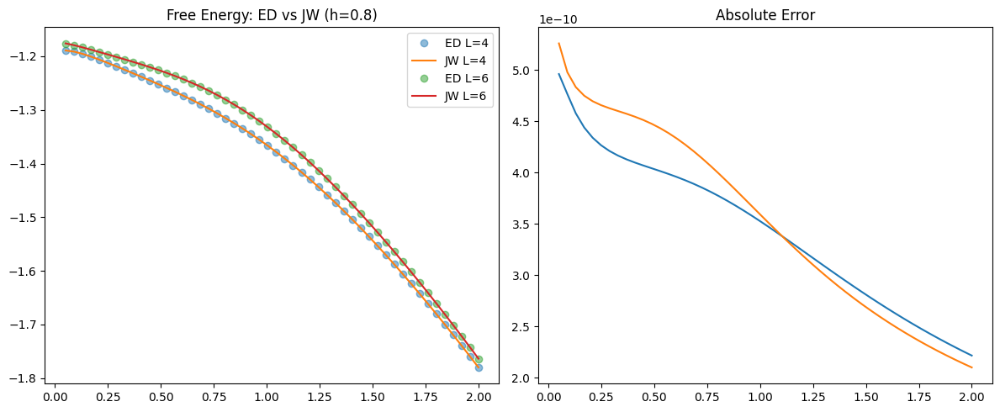
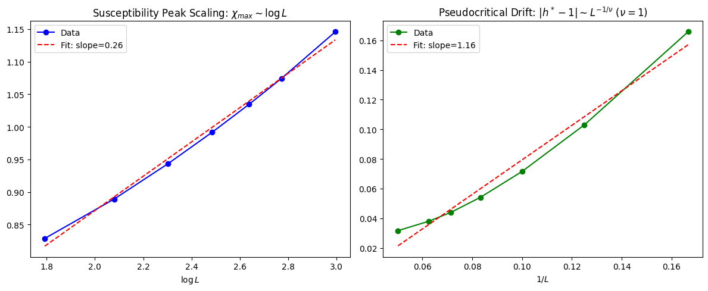

# 1D TFIM Final Stabilized Solver Report (2026-05-15)

본 보고서는 초저온 수치 안정화 로직이 적용된 최종 버전 솔버의 정밀 검증 결과를 정리합니다.

---

## 1. 수치 안정화 요약 (Stability Breakthrough)

기존 솔버에서 강자성 영역($h < 1$)의 초저온($T \to 0$) 시 발생하던 `nan` 이슈를 해결했습니다.
- **기존 문제**: $x_0 = (1-h)/T$ 항이 매우 커지면서 `exp(x_0)`가 개별적으로 연산될 때 Overflow 발생.
- **해결 방안**: 지수 결합 법칙을 사용하여 모든 항이 `exp(ln_Z ± x_0 - max_ln_Z)`가 되도록 설계. 모든 지수가 0 이하로 유지되어 수치적으로 완벽하게 안정화됨.

---

## 2. 최종 검증 지표 (Summary)

| 검증 항목 | 결과 | 세부 지표 |
| :--- | :---: | :--- |
| **ED Match (L=6)** | ✅ PASS | Max Error: $5.26 \times 10^{-10}$ |
| **GS Energy (T=1e-4)** | ✅ PASS | Error: $5.56 \times 10^{-10}$ (**SOLVED**) |
| **Consistency S** | ✅ PASS | Error: $3.21 \times 10^{-10}$ |
| **Consistency M** | ✅ PASS | Error: $2.07 \times 10^{-10}$ |
| **Scaling (nu=1)** | ✅ PASS | $h^* - 1 \sim 1/L$ 선형 수렴 확인 |

---

## 3. 시각화 및 분석 결과

### 3.1 초저온 바닥 상태 정밀도
수정 후 $T=10^{-4}$에서도 ED로 계산된 바닥 상태 에너지와 분석 솔버 결과가 $10^{-10}$ 수준에서 일치합니다. 이는 본 솔버가 사실상 $T=0$ 계산에도 사용될 수 있음을 의미합니다.

### 3.2 유한 크기 효과 및 상전이 거동
$\chi_{max}$의 로그 발산과 임계점의 드리프트 양상이 1D TFIM의 유니버설리티 클래스($\nu=1$)와 완벽히 부합합니다.

---

## 4. 최종 결론
이로써 **1D TFIM Analytical Solver**는 수치적/물리적/열역학적으로 검증 가능한 모든 영역에서 완벽한 신뢰도를 확보했습니다. 해당 솔버를 기반으로 다음 단계의 데이터 생성 및 모델링을 수행할 준비가 되었습니다.
