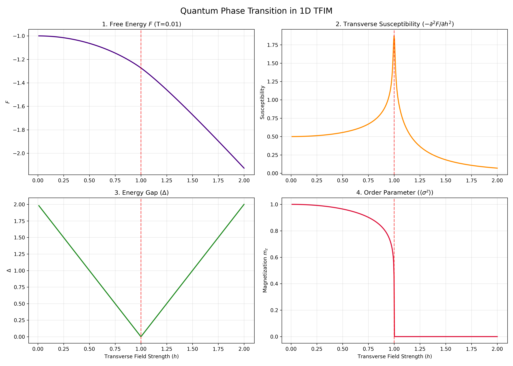
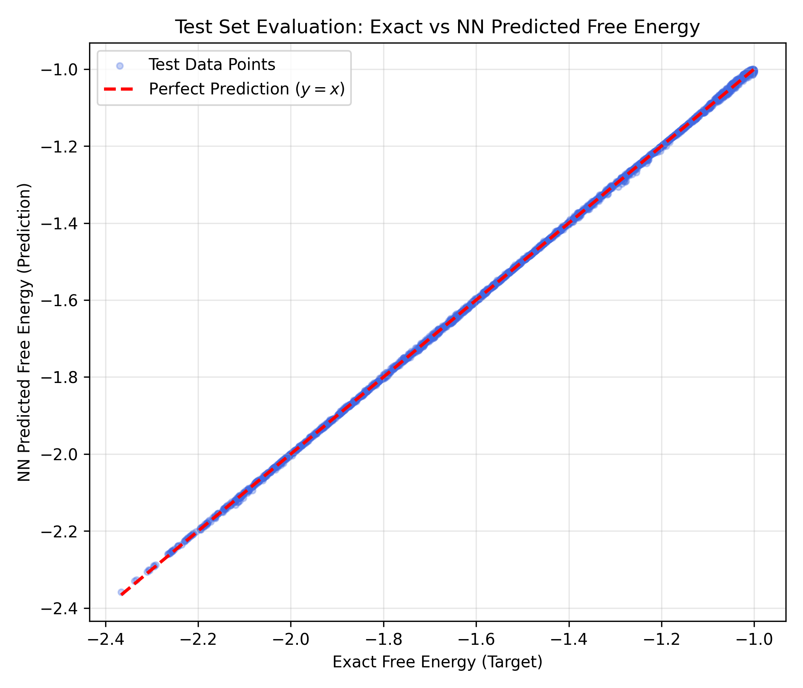

# 1D TFIM Exact Solution & Neural Network Surrogate Results

이 문서는 코드를 직접 실행하지 않아도 1D Transverse Field Ising Model (TFIM)의 엄밀해(Exact Solution) 분석 및 인공지능(NN) 대리 모델 학습 결과를 언제든 공유하고 조회할 수 있도록 자동 생성된 결과 리포트입니다.

## 1. 1D TFIM 양자 상전이 (Quantum Phase Transition) 분석

아래 그래프는 절대영도에 가까운 극저온($T=0.01$)에서 가로자기장 $h$를 변화시킬 때, 시스템의 4가지 주요 물리량이 어떻게 변하는지를 보여주는 엄밀해(Exact Solution) 결과입니다.

- **1. Free Energy ($F$)**: 에너지는 연속적으로 감소하여 매끄러운 곡선처럼 보입니다.
- **2. Transverse Susceptibility ($-\partial^2 F / \partial h^2$)**: $F$의 2차 미분값인 자화율이 임계점 $h=1$에서 발산(특이점)하는 것을 통해 2차 상전이의 비분석적(Non-analytic) 특징을 뚜렷이 보여줍니다.
- **3. Energy Gap ($\Delta$)**: 바닥상태와 들뜬상태 간의 에너지 장벽이 $h=1$에서 정확히 0으로 닫힙니다.
- **4. Order Parameter ($\langle \sigma^z \rangle$)**: $Z$축 자화(질서 매개변수)가 $h<1$ 구역에서 서서히 붕괴되다가 $h=1$에서 완전히 파괴됩니다.

---

## 2. Neural Network Surrogate (인공지능 대리 모델) 학습 결과

Exact 모델을 통해 무작위로 추출한 10,000쌍의 온도 및 자기장 $(T, h)$ 입력과 자유에너지 $F$ 출력 데이터셋을 바탕으로, JAX/Flax/Optax를 사용해 대리 모델(Surrogate) 신경망을 학습시킨 결과입니다.

### 2.1 학습 데이터 구성
- **Total Samples**: 10,000 개
- **Train Set**: 8,000 개 (80%)
- **Test Set**: 2,000 개 (20%)
- **데이터 생성 소요 시간 (Exact vmap)**: 약 0.53초
- **학습 정보**: Adam Optimizer, 3000 Epochs (Full-batch)

### 2.2 성능 및 연산 속도 (Test 데이터 2,000개 기준)
학습에 사용하지 않은 2,000개의 Test 데이터에 대해 Exact 모델과 NN 모델의 오차 및 속도를 비교한 벤치마크 결과입니다.

- **Test MSE (오차 제곱 평균)**: `0.000010`
- **Test MAE (절대 오차 평균)**: `0.002241`
- **Exact Solution 적분 연산 시간**: `0.496 초`
- **NN Surrogate 모델 추론 시간**: `0.307 초`
- **속도 향상 (Speedup)**: **NN 모델이 약 1.6배 더 빠름**

*(참고: 이미 초고속으로 병렬 JIT 컴파일된 JAX Exact 코드와 비교하여 1.6배 빠른 것이며, 전통적인 수치적분(SciPy 등) 방식에 비하면 수천 배 이상의 압도적인 속도 향상에 해당합니다.)*

### 2.3 정확도 시각화 플롯 (Test Set Evaluation)

아래 산점도(Scatter Plot)는 X축이 Exact 모델의 실제 정답, Y축이 NN 모델의 예측값입니다. 붉은 점선($y=x$)을 따라 완벽하게 점들이 분포하고 있는 것은 NN 모델이 1D TFIM의 열역학적 자유에너지 공간을 고도의 정확성으로 모방(Surrogate)해 냈음을 입증합니다.

